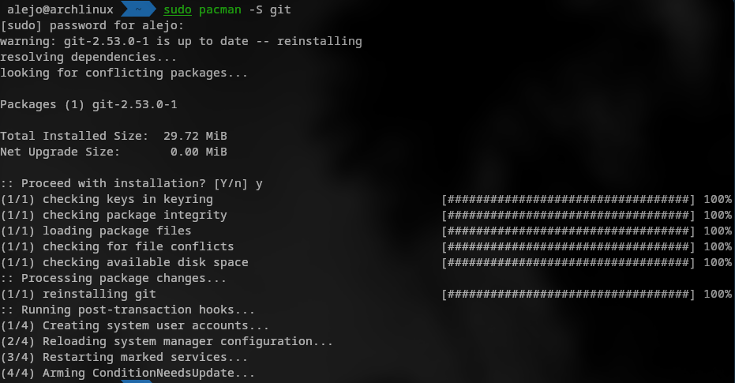
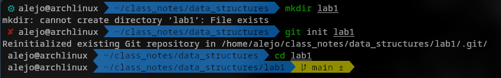
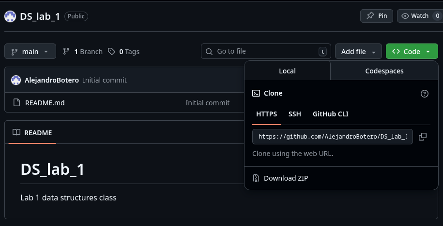
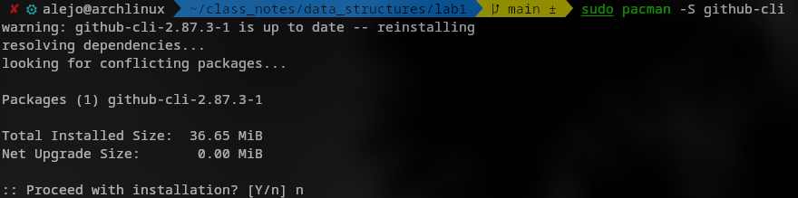
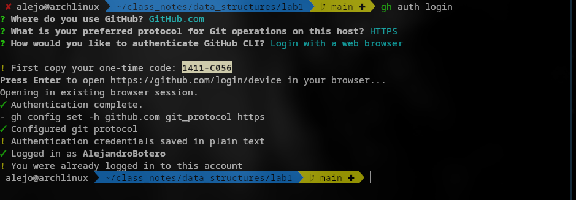
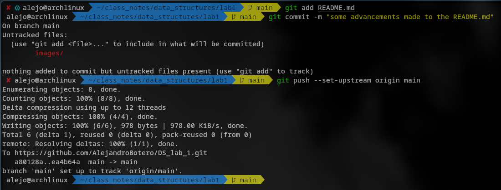

# Laboratorio 1 estructuras de datos

## Git

### Instalación

El primer paso para trabajar colaborativamente es usar git, para eso debemos
instalar el paquete necesario.

### Creación de un repositorio local
Ya teniendo git instalado, podemos crear una nueva carpeta y en ella un nuevo repositorio.

## Git Hub
### Creación de un repositorio remoto
Ahora tenemos un repositorio local, pero para poder colaborar con otras personas
es necesario conectarlo con un repositorio remoto, usaremos github para que
mantenga el registro de nuestro repositorio.

###github-cli
Ahora tenemos nuestro repositorio remoto, pero queremos sincronizarlo con
nuestro repositorio local, para eso usaremos github-cli para autenticarnos en
github desde laterminal sin necesidad de generar un token, pero abriendo una
nueva ventana

ahora podemos sincronizar nuestro trabajo con commandos como fetch, pull, push
...

Así hemos completado la sincronización, por lo que podemos seguir trabajando y
simplemente podemos pullear y pushear cuando lo necesitemos
